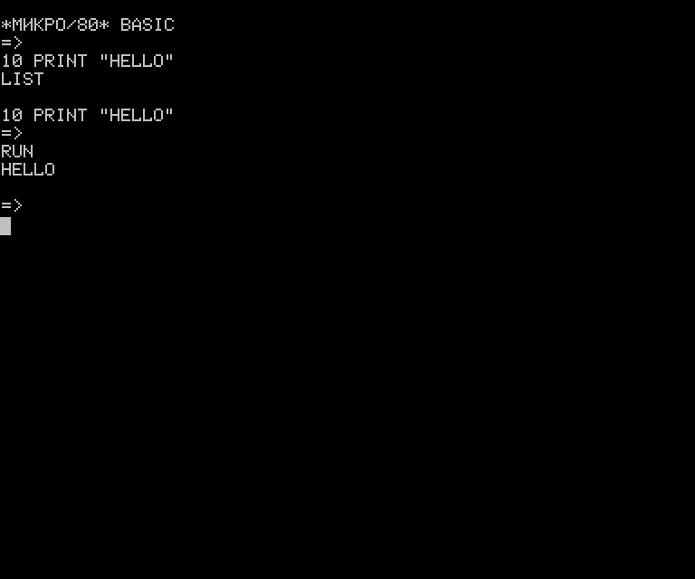

# * МИКРО/80 * BASIC

# * РАДИО-86РК * BASIC 
# * ЮТ-88 * BASIC
# * МИКРО/80 * BASIC-SERVICE
# * РАДИО-86РК * BASIC-SERVICE
# * ЮТ-88 * BASIC-SERVICE

Это исходный код на ассемблере Бейсиков и Бейсиков-Сервис для Микро-80/Радио-86РК. С комментариями.
Чисто теоретически, варианты Бейсика для Микро-80 должены без изменений работать на ЮТ-88.

Язык программирования высокого уровня — Бейсик был разработан еще в 1964 г., но по-настоящему широко стал применяться только после появления микропроцессоров и микроЭВМ.

Бейсик, в отличие от других языков программирования,
очень прост для освоения начинающими программистами — это его основное преимущество.
Однако, несмотря на простоту, на нем можно создавать весьма сложные программы,
решающие самые разнообразные задачи: от игровых до программ статистической обработки
информации, автоматизации проектирования и управления различными объектами.

К недостаткам языка Бейсик следует отнести отсутствие
общепринятого стандарта на его основные элементы и средства для написания, так
называемых, структурированных программ. Первый недостаток привел к появлению
большого количества реализаций трансляторов с языка Бейсик, имеющих весьма различные
характеристики, второй — к критике языка профессиональными программистами.

Несмотря на эти недостатки, мы все же считаем
этот язык наиболее подходящим для простых микро-ЭВМ и предлагаем читателям версию
транслятора, который при малом объеме (6,5 Кбайт) имеет достаточно широкие возможности
и позволяет при небольших переделках исполнять на микроЭВМ «Микро-80» практически
любые программы, написанные на Бейсике, но разработанные для других ЭВМ. В последней
статье цикла «Радиолюбителю о микропроцессорах и микро-ЭВМ» мы очень кратко
обсудили вопрос о различии между двумя видами трансляторов — компиляторов и
интерпретаторов. Описываемый ниже транслятор реализован в виде интерпретатора.
Это означает, что в памяти ЭВМ должны находится одновременно, как сама программа
интерпретатора, так и программа, написанная на языке Бейсик. Такой подход позволяет
возложить на интерпретатор, кроме трансляции программ, и некоторые дополнительные
функции, а именно: редактирования текстов при подготовке текстов программ и
внесения в них изменений и отлаживания для эффективного поиска ошибок. Таким
образом, будучи загружен в ОЗУ микро-ЭВМ и запущен в работу, интерпретатор позволяет,
как разрабатывать новые программы, так и загружать (с магнитной ленты) и запускать
в работу программы, разработанные ранее.

Описываемая версия интерпретатора требует наличия оперативной памяти объемом не менее 12
Кбайт (начиная с адреса 0000Н). Интерпретатор хранится на магнитной ленте
и загружается в ОЗУ с помощью директивы «I» Монитора. Для ввода-вывода информации
интерпретатор использует подпрограммы Монитора.

Ячейки памяти 0002Н, 021СН, 0230Н и 0242Н хранят
старший байт адреса конца ОЗУ микро-ЭВМ. В эти ячейки вы должны поместить одинаковые
константы, соответствующие объему ОЗУ вашей микро-ЭВМ. Для ОЗУ объемом 12, 16,
32 и 48 Кбайт эти константы должны быть соответственно равны 2FH, 3FH, 7FH и
BFH.

Запускают интерпретатор в работу по директиве
«J0» Монитора. На экране дисплея при этом появляется сообщение:

<pre>
 * МИКРО/80 * BASIC.
</pre>

что означает готовность интерпретатора к приему
директив оператора.

Интерпретатор имеет два основных режима работы:
непосредственной интерпретации и интерпретации программы, хранящейся в памяти.
Далее для краткости будем называть первый режим просто непосредственным, а второй
— программным.

Непосредственный режим работы позволяет использовать
микро-ЭВМ для выполнения вычислений без написания программы, то есть примерно
так же, как калькулятор для научно-технических расчетов. Например, необходимо
рассчитать мощность, рассеиваемую на коллекторе транзистора выходного каскада.
Как известно, для этого случая справедливо соотношение

<pre>
Рк = Ек2 /4 * ?2 * Rн. 
</pre>
где Ек — напряжение на коллекторе, Rн — сопротивление нагрузки.

Пусть, например, Ек = 12 В, Rн = 8 Ом. Если теперь набрать на клавиатуре выражение

<pre>
PRINT 12 ^ 2/(4*(3.14) ^ 2 *8),
</pre>

то после нажатия на клавишу «ВК» мы тут же на экране дисплея прочтем ответ:

<pre>
0.456408
</pre>

Обратите внимание, что в Бейсике для обозначения операции возведениястепень
используется символ «^», вместо запятой в числах с десятичными дробями — точка,
а указание знака умножения «*» строго обязательно. Кроме того, для указания последовательности
вычислений введены круглые скобки. Если эти вычисления необходимо произвести несколько
раз (для разных значений Ек и Rн), то целесообразно написать простую программу:

<pre>
ПРИМЕР 1
10 REМ РАСЧЕТ МОЩНОСТИ
20 PI = 3.14156
30 PRINT 'ВЕЛИЧИНА НАПРЯЖЕНИЯ?'
40 INPUT EК
50 PRINT 'СОПРОТИВЛЕНИЕ НАГРУЗКИ?'
60 INPUT RN
70 PK = EK^2/(4*&lt;PI&gt;^2*RN)
80 PRINT 'РАССЕИВАЕМАЯ МOЩHOCTЬ ='; PK
90 INPUT 'ПРОДОЛЖИМ (Д ИЛИ Н) ", X$
100 IF Х$='Д' THEN 30
110 STOP
</pre>
но прежде чем подробно обсуждать работу этой программы,
необходимо познакомиться с некоторыми терминами и понятиями.

Программа на Бейсике состоит из последовательности пронумерованных
строк. Им принято присваивать номера с интервалом равным 10. В дальнейшем это
может оказаться полезным, если понадобится вставить несколько дополнительных
строк в программу. Номера могут быть любыми от 0 до 65529. Каждая строка программы
может состоять из одного или нескольких операторов, предписывающих интерпретатору
определенные действия. Если операторов несколько, то их отделяют друг от друга
символом «:» (двоеточие). В качестве операндов выступают выражения, составленные
из констант и переменных. В Бейсике существуют два типа констант: числовые и
символьные. Числовые константы — это любые десятичные числа в интервале от −1,7*1035
до +1,7*1035, символьные — последовательность любых отображаемых символов, заключенная
в кавычки.

Например:
* «МОСКВА», «КП350». «РЕЗУЛЬТАТ=» — символьные константы,
* 220, −380, 3.14, −3.00ЗЕ-03, 8Е12 — числовые.

Две последние константы заданы в экспоненциальной форме, на что указывает буква
Е, за ней следуют знак (у положительных чисел знак «+» можно опускать) и величина
порядка. Точность задания констант — 6 значащих цифр.

В программах на Бейсике используются переменные
двух типов: числовые и символьные. Обращаются к переменным по имени, которое
состоит из одного или двух символов. Первый из них обязательно должен быть буквой
латинского алфавита, второй — буквой этого же алфавита или цифрой. Символьные
переменные после имен содержат знак «$».

Например:
* А, А8, К — допустимые имена числовых переменных;  
* A$, АТ$, С3$ — символьных.

Группе переменных одного типа может быть присвоено
общее имя, и их в этом случае называют переменными с индексами или массивами.
Мы будем пользоваться в дальнейшем термином «массив». Для обращения к каждой
отдельной переменной в массиве используют один или несколько индексов. Наименьшее
значение индекса равно 0, а наибольшее определяется размером массива. Если индекс
один, то говорят, что массив одномерный, два — двумерный и т.д. Имена массивов
подчиняются тем же правилам, что и имена переменных. Индексы необходимо указывать
в круглых скобках после имени массива. Разрешено использование массивов как
числовых, так и символьных переменных.

Например:

* AB(4) четвертый элемент одномерного массива AB;
* LS(3,8) — элемент, стоящий на пересечении 3 ей строки и 8-го столбца двумерного массива LS; 
* К$(5) — пятый элемент одномерного массива К$.

При работе программы для каждого массива в памяти
ЭВМ резервируется соответствующая область. Перед использованием массив должен
быть описан при помощи оператора DIM. Более подробно об этом мы поговорим позже.

Переменные и константы образуют выражения языка
Бейсик. Кроме них, в выражения входят знаки операций, скобки и имена функций.
Обращаются к функциям по имени, аргумент при этом указывают в круглых скобках
после него. Все выражения можно разделить на 4 типа:

* арифметические,
* символьные,
* выражения отношения и
* логические.

В табл. 3 приведены знаки операций, принятые в Бейсике.

Таблица 3

{| class=border
|-
| Знак операции || Операция
|-
| Арифметические операции || &nbsp;
|-
| + || СЛОЖЕНИЕ
|-
| — || ВЫЧИТАНИЕ
|-
| * || УМНОЖЕНИЕ
|-
| / || ДЕЛЕНИЕ
|-
| ^ || ВОЗВЕДЕНИЕ В СТЕПЕНЬ
|-
| &nbsp; || &nbsp;
|-
| &gt; || БОЛЬШЕ
|-
| &lt; || МЕНЬШЕ
|-
| = || РАВНО
|-
| &lt;&gt; || НЕ РАВНО
|-
| &gt;= || БОЛЬШЕ ИЛИ РАВНО
|-
| &lt;= || МЕНЬШЕ ИЛИ РАВНО
|-
| Логические операции || &nbsp;
|-
| NOT || ОТРИЦАНИЕ («НЕ»)
|-
| AND || ЛОГИЧЕСКОЕ УМНОЖЕНИЕ («И»)
|-
| OR || ЛОГИЧЕСКОЕ СЛОЖЕНИЕ («ИЛИ»)
|}

Числовые переменные и константы могут принимать участие в выражениях
любого типа. Для символьных переменных и констант разрешены только операции
отношения и конкатенации (слияния), обозначаемые знаком «+»

<pre>
ПРИМЕР 2
====================
ПУСТЬ A$="ТЕЛЕ", B$="ФОН", C$="ВИЗОР",
ТОГДА: M$=A$ + B$="ТЕЛЕФОН"
L$=A$ + C$="ТЕЛЕВИЗОР"
B$ &lt;&gt; C$
</pre>

При вычислении результата выражения все операции имеют определенный
приоритет. Табл. 4 показывает приоритет операций, определяющий порядок вычислений.
Чем выше в таблице находится знак той или иной операции, тем выше ее приоритет.

Таблица 4

<pre>
^,*, /,+, -,
=, <>, <, >, >=, <=
NOT
AND
OR
</pre>

Во всех алгоритмических языках одним из основных
операторов является оператор присваивания. В Бейсике это — оператор LET. Так,
запись LET В1=12 означает, что переменной (или константе) B1 присваивается
значение 12. В описываемом интерпретаторе слово LET не используется и поэтому
нужно просто писать В1=12.

Теперь мы можем вернуться к примеру 1. В строке
20 константе PI (число π) присваивается значение
3.14156. В строках 30, 50 и 80 записаны операторы печати. Поэтому на экран будут
выведены соответствующие сообщения. В строках 40, 60 и 90 записаны операторы
ввода, в результате выполнения которых, интерпретатор запрашивает ввод с клавиатуры
дисплея. В первых двух случаях числовые значения, в последнем — символьное значение.
Введенное с клавиатуры слово присваивается символьной переменной Х$.

В строке 100 использован условный оператор, который
в случае выполнения условия передает управление на начало программы (строка
30). В противном случае будет выполнен оператор STOP, прекращающий выполнение
программы и переводящий интерпретатор в непосредственный режим работы.

Мы уже говорили, что интерпретатор реализует также
функции редактора текстов и отладчика. Перед вводом текста новой программы необходимо
сначала стереть в памяти микро-ЭВМ старую программу, воспользовавшись директивой
NEW, а затем с клавиатуры набрать программу (не забывая набирать в начале каждой
строки ее номер). Для исправления неверно набранных символов служит клавиша
«» (так же, как и в Мониторе), а клавиша «» — для стирания всей неверно набранной
строки. Ввод каждой строки заканчивают нажатием на клавишу «ВК». Если случайно
будет нажата клавиша «СТР», то управление передается программе Монитор и для
повторного запуска интерпретатора в работу необходимо воспользоваться директивой
Монитора «J0». Перезапуск интерпретатора не приводят к потере текста ранее набранной
программы.

Просмотреть текст программы можно при помощи
директивы '''LIST'''. Если необходимо удалить какую-либо строку программы,
достаточно набрать ее номер и нажать на клавишу «ВК», а чтобы вставить в текст
новую, набрать номер любой строки, попадающий в интервал между двумя соседними,
затем саму строку и нажать на клавишу «ВК».

Интерпретатор игнорирует любые пробелы, если только
они не стоят внутри символьных констант. Это создает определенные удобства,
так как при использовании пробелов для выделения операторов улучшается читаемость
программы (хотя несколько и увеличивается ее объем). Для исправления строки,
содержащей ошибки, набирают ее заново (с тем же номером). После нажатия на клавишу
«ВК» вновь набранная строка встанет на место старой.

Отладка программы на Бейсике производится также
при помощи интерпретатора. Для этой цели использована возможность перевода интерпретатора
из программного режима в непосредственный при выполнении оператора '''STOP'''
или одновременном нажатии на клавиши «УС» и «С». В непосредственном режиме можно
просмотреть и при необходимости модифицировать (изменить) значения переменных,
снова просмотреть текст программы по директиве '''LIST''' и затем продолжить
выполнение программы с того места, где она была прервана.

Перейдем теперь к подробному описанию нашей версии
интерпретатора с языка Бейсик и, прежде всего, рассмотрим его системные директивы.
Отметим только, что далее по тексту фигурные скобки будут означать, что данные
параметры в конкретной директиве могут отсутствовать. В этом случае используют
так называемые соглашения по умолчанию, которые будут оговорены особо.

== Директивы языка Бейсик ==

Директива '''NEW''' подготавливает интерпретатор
для ввода новой программы с клавиатуры дисплея. Текст программы, набранный ранее,
стирается.

Директива '''RUN(N)''' служит для запуска программы
со строки с номером N. Если номер строки отсутствует, то работа программы начинается
со строки с наименьшим номером. Всем переменным присваивается значение 0 или
«пустая строка»,

Директива '''LIST(N)''' инициирует распечатку
текста программы, находящейся в ОЗУ, начиная со строки с номером N. Если номер
отсутствует, то распечатка начинается с начала программы.

Директива '''CONT''' позволяет продолжить выполнение
программы с того места, где она была прервана нажатием на клавиши «УС» и «С»,
или при выполнении оператора '''STOP'''. Эта директива— одно из основных средств
отладки программ на Бейсике. В случае невозможности дальнейшего выполнения программы
на экран дисплея выдается соответствующее сообщение об ошибке.

Директива '''MSAVE(имя)''' позволяет переписать
программу на Бейсике из ОЗУ на магнитную ленту. Имя программы должно состоять
из одного символа латинского алфавита, Впрочем, его можно и не указывать. В
этом случае и при последующем вводе программы ее имя также указывать не следует.

Директива '''MLOAD(имя)''' предназначена для
загрузки программ на Бейсике с магнитной ленты в ОЗУ. Если имя программы указано,
то происходит поиск данной программы, если нет— в ОЗУ загружается первая встретившаяся
программа на Бейсике, записанная без указания имени.

== Операторы языка Бейсик ==

В Бейсике имеется ряд операторов, которые можно
разделить на две группы:

* Выполняемые,
* невыполняемые (операторы описания).

Рассмотрим сначала последние.

Оператор '''REM''' служит для вставки в текст
программы комментариев. Он не влияет на выполнение программы, так как все, что
стоит в строке за этим оператором, интерпретатором игнорируется.

Оператор '''DIM''' предназначен для описания
массивов, используемых в программе. Массив можно не описывать, если его размерность
не превышает 10. Одним оператором '''DIM''' можно описать сразу несколько массивов.

<pre>
ПРИМЕР 3
=============
10 DIM A (30), B (15,15), C2 (3,3,3) 
20 DIM P$(5), R$(7,4)
</pre>

Массив должен быть описан в программе до его использования,
иначе вступает в силу описание по умолчанию.

Оператором '''DATA''' можно описывать данные
непосредственно в программе. Значения данных присваиваются переменным программы
при помощи оператора '''READ'''. Программа может содержать любое число операторов
'''DATA''', и располагаться они могут в любом ее месте, независимо от положения
операторов '''READ'''. Оператором '''DATA''' могут быть описаны любые данные,
как числовые, так и символьные:

<pre>
ПРИМЕР 4
10 DATA 12,865, "КП103М", "КР580ВК28"  
20 DАТА 'ТРАНЗИСТОР', 'МИКРОСХЕМА'
</pre>

Все данные, описанные при помощи оператора '''DATA''',
образуют так называемый блок данных. Данные из блока можно считать, воспользовавшись
оператором '''READ'''. Они будут выведены последовательно, начиная с первого.
После каждого обращения к блоку происходит перемещение на одну позицию так называемого внутреннего (для интерпретатора) указателя данных.

Существует еще один оператор описания, но с ним
мы познакомимся далее, в разделе, посвященном встроенным функциям Бейсика.

Выполняемые операторы, в свою очередь, также могут
быть разделены на ряд групп:

* ввода-вывода,
* управления ходом выполнения программы,
* организации циклов,
* графические и
* связи с машинными ресурсами.

Особое место занимает условный оператор.

Оператор '''READ''' предназначен для чтения данных из блока и присвоения конкретных
значений переменным программы. Запись этого оператора в программе выглядит так:

<pre>
READ XI, Х2, ..., XN
</pre>
где XN— имена числовых или текстовых переменных.

При описании данных программист обязан строго следить за соответствием
типов данных и переменных. При каждом выполнении оператора '''READ''' указатель
данных смещается на одну позицию.

Оператор '''RESTORE'''. Служит для перемещения
указателя в первую позицию, обеспечивая тем самым возможность повторного считывания
данных из блока.

Оператор '''INPUT''' позволяет вводить данные
с клавиатуры дисплея непосредственно при выполнении программы на Бейсике. Значения
введенных данных присваиваются переменным, имена которых указывают вслед за
оператором '''INPUT'''. Это могут быть как числовые, так и символьные переменные.
Использование оператора иллюстрирует следующий пример:

<pre>
ПРИМЕР 5
==================
10 INPUT A1 
20 INPUT A2, A3, A4 
30 INPUT B$, E2
</pre>

При выполнении оператора '''INPUT''' на экране
дисплея возникает символ «'''?'''». В ответ на этот вопрос с клавиатуры вводят
данные, которые «распечатываются» на экране в строку сразу после этого символа.

Если оператором '''INPUT''' необходимо ввести
несколько переменных, то после ввода очередного значения необходимо нажать на
клавишу «''','''». Ввод данных заканчивается нажатием на клавишу «ВК». Если
после появления знака «'''?'''» сразу нажать на клавишу «ВК», то интерпретатор
переходит из программного режима в непосредственный.

После оператора '''INPUT''' может стоять строка
символов, заключенная в кавычки. В этом случае при выполнении оператора на экран
дисплея будет выведено сначала это сообщение, а затем знак «'''?'''»:

<pre>
ПРИМЕР 6 
====================== 
40 INPUT "ВАШЕ ИМЯ"; I$
</pre>

При вводе данных, пока не нажата клавиша конца
ввода «ВК», для внесения исправлений можно пользоваться клавишей «».

Оператор '''PRINT''' предназначен для вывода
на экран дисплея значений переменных, сообщений и результатов вычислений. Если
оператор использован без операнда, то это приводит к печатанию одной пустой
строки. При вводе программы и в непосредственном режиме вместо слова '''PRINT'''
можно набрать символ «'''?'''». В этом случае при последующем просмотре текста
программы по директиве '''LIST''', вы увидите, что в тексте знак «'''?'''»
автоматически заменен на слово '''PRINT'''.

Операндов, стоящих вслед за оператором '''PRINT''',
может быть несколько, и тогда их отделяют друг от друга разделителями ", « или
„;“, причем при использовании первого под каждое выводимое значение отводится
14 позиций, а строке, второго— столько, сколько необходимо.

Числа при печати могут быть представлены в виде
целого числа, числа с десятичной точкой и в экспоненциальном виде. В любой форме
печатается не более 6 цифр.

Если после последнего операнда в операторе '''PRINT'''
стоит разделитель, то при выполнении следующего оператора '''PRINT''' печать
будет продолжена в той же строке. Если же разделителя нет, то печать начнется
с новой строки. Для печати данных в определенном месте экрана при помощи оператора
'''PRINT''' в языке Бейсик предусмотрены специальные функции, рассматриваемые
ниже. Следующий пример иллюстрирует использование оператора '''PRINT''':

<pre>
ПРИМЕР 7 
====================
10 PRINT "ПРОГРАММА РАСЧЕТА УСИЛИТЕЛЯ" 
20 PRINT "КОЛИЧЕСТВО="; A6 
30 PRINT A, B, S4 
40 PRINT 45*A2*S3 
50 PRINT A$, A2$, N7 
</pre>

Оператор '''CUR X, Y''' служит для перемещения
курсора в позицию с координатой '''Х''' по горизонтали и координатой '''Y'''
по вертикали. Начало отсчета— левый нижний угол экрана. Диапазон изменения
координат курсора по горизонтали— 0-63, по вертикали— 0-31. Если после оператора
'''CUR''' сразу выполняется оператор печати '''PRINT''', то вывод информации
на экран начнется с позиции с координатами '''Х''' и '''Y''':

<pre>
ПРИМЕР 8
==================
10 CUR 25,15 
20 PRINT "ГPAФИK #5"
</pre>

После выполнения этой программы в центре экрана
появится текст „ГРАФИК 5“. Оператор '''CUR''' позволяет создавать программы,
реализующие так называемый экранный режим работы и полностью использующие возможности
нашего дисплея. К ним можно отнести разнообразные игровые программы, экранные
редакторы текстов, программы обработки информации, представленной в табличной
форме, и многие другие.

Программа на Бейсике выполняется строка за строкой,
в соответствии с их номерами. Однако имеется ряд операторов, изменяющих естественный
ход выполнения программы.

Оператор '''GOTO N'''— это оператор безусловной
передачи управления на строку с номером N.

Операторы '''GOSUB N''' и '''RETURN''' служат
для организации подпрограмм. Что такое подпрограммы и необходимость их применения
мы уже обсуждали ранее применительно к языку ассемблера. Оператор '''GOSUB N'''
передает управление на строку с номером N. Заканчиваться подпрограмма должна
обязательно оператором '''RETURN'''. После его выполнения происходит возврат
в то место основной программы, откуда произошел вызов подпрограммы. Допускается
многократная вложенность подпрограмм, степень вложенности ограничена только
объемом свободной памяти.

Операторы '''ON Х GOTO N1, N2, … …NM''' и
'''ON Х GOSUB N1, N2 … NM''' в зависимости от результата вычисления выражения
'''Х''' реализуют условную передачу управления на одну из строк программы,
номер которой указан в списке, следующем за оператором. При выполнении оператора
сначала вычисляется значение выражения '''X''', от результата берется целая
часть, которая и указывает в списке на номер строки. Если результат выражения
равен 1, то управление будет передано на строку N1, двум— на строку N2 и т.
д. Если же результат выражения меньше единицы или больше, чем количество номеров
строк в списке, то выполняется оператор, непосредственно следующий за оператором
'''ON-GOTO''' или '''ON-GOSUB'''. Рассмотренные операторы в литературе часто
называют „переключателями“. Действительно, их работа похожа на работу многопозиционного
переключателя, коммутирующего прохождение сигнала по одному из возможных направлений.
„Переключатель“ позволяет сократить текст программы в тех случаях, когда необходим
анализ множества вариантов, программисту же необходимо так „подобрать“ выражение
X, чтобы при всех возможных значениях входящих в него переменных происходило
„переключение“ на строку с нужным номером.

Оператор '''STOP''' предназначен для прекращения
выполнения программы и перевода интерпретатора в непосредственный режим. Этот
оператор очень удобен при отладке программ, так как позволяет создать в них
контрольный останов. Выполнение прерванной программы можно продолжить, выдав
интерпретатору директиву '''CONT'''. После выполнения оператора '''STOP'''
на экран дисплея выводится сообщение:

<pre>
"СТОП в XX"
</pre>
где XX— номер строки, в которой произошел останов.

Программы, написанные на любом языке программирования,
обычно содержат многократно повторяющиеся фрагменты— циклы. Для организации
циклов в языке Бейсик имеются специальные операторы.

Оператор '''FOR Х ТО Y STEP Z'''— это оператор
инициализации цикла, а оператор '''NEXT Х'''— оператор конца цикла. Все, что
находится между ними, называют телом цикла. В операторе инициализации цикла
Х— выражение, задающее имя переменной цикла и присваивающее ей начальное значение;
Y— выражение, определяющее конечное значение переменной цикла, Z— значение,
на которое должна измениться переменная цикла (шаг цикла) после каждого выполнения
оператора '''NEXT'''. Если шаг цикла равен +1, то выражение '''STEP Z''' можно
опустить. Проиллюстрируем сказанное на примере:

<pre>
ПРИМЕР 9
====================
10 FOR 1=0 ТО 10 STEP 2 
20 PRINT I; 
30 NEXT I
</pre>

После выполнения этой программы на экране дисплея
появится 6 значений: 0246810. В данном примере оператор, стоящий в строке 20,
является телом цикла. Таким образом, сущность работы оператора цикла заключается
в следующем:

* задается начальное значение переменной цикла;
* выполняются операторы, входящие в тело цикла;
* проводится проверка достижения переменной цикла конечного значения;
* изменяется значение переменной цикла на величину, равную шагу цикла;
* если конечное значение не достигнуто, то все перечисленные выше операции повторяются вновь; если конечное значение достигнуто, управление передается оператору, следующему непосредственно за оператором '''NEXT'''.

Шаг цикла может принимать и отрицательное значение:

<pre>
ПРИМЕР 10
====================
10 FOR I = 10 TO 0 STEP -2 
20 PRINT I; 
30 NEXT I
</pre>

В этом случае последовательность выведенных на экран значений будет обратной: 10 8 6 4 2 0.

Заметьте: операторы, входящие в тело цикла, в любом случае выполняются хотя бы один раз, так как проверка условия окончания производится в конце цикла.

Организовать циклическую работу программы можно
и без специального оператора цикла (например, при помощи оператора '''GOTO'''
и условного оператора, описываемого ниже), однако его использование значительно
упрощает разработку программ, освобождая программиста от необходимости проведения
изменения переменной цикла и проверки его окончания.

Условный оператор '''IF X THEN Y'''— один из
фундаментальных операторов, имеющихся практически в любом алгоритмическом языке
программирования высокого уровня. Работа его заключается в следующем. Проверяется
выполнение условия X:

* если Х— истинно, то выполняются операторы, стоящие в строке после слова THEN;
* если Х— ложно, то управление будет передано следующей строке программы.

(Выражение Х считают ложным, если его результат
равен нулю, в противном случае Х истинно). Выражение Х может включать проверку
самых различных условий с использованием, как операций отношения, так и логических
операций. Операторы, стоящие после слова '''THEN'''. также могут быть различными.
В частности, если необходимо выполнить оператор GOTO, то название оператора
можно опустить и просто указать номер строки программы, которой следует передать
управление. Следующий пример иллюстрирует использование условного оператора:

<pre>
ПРИМЕР 11
===================
IF X=10 THEN 1000
IF A =0 THEN В = 1
IF A = 5. AND C = 7 THEN GOSUB 1000 
IF 2 = 0 OR F = 0 THEN L=15: GOTO 250 
IF B$="HET" THEN PRINT "ВЕРНО" 
IF K$="ДА" OR K$="Д" THEN STOP
</pre>
 
Особенностью описываемой версии интерпретатора
языка Бейсик является наличие операторов, позволяющих формировать графические
изображения на экране дисплея.

[[Изображение:M80Basic.png|right]]

Оператор '''CLS''' предназначен для стирания информации с экрана и прежде, чем начнется
формирование графических изображений. В графическом режиме на экране дисплея
возможно отображение 128 точек по горизонтали и 64 точек по вертикали. На рис.
1 показан формат экрана в графическом режиме. Точки адресуются в прямоугольной
системе координат с началом в левом нижнем углу экрана.

Оператор '''PLOT X, Y, L''' позволяет погасить
(или высветить) точку с координатами 0 &lt; Х &lt; 127 по горизонтали и 0 &lt;
У &lt; б3 по вертикали. Если операнд Z равен 1, то соответствующая точка засвечивается,
0— гаснет. Например, следующая программа „рисует“ на экране прямую линию с
начальными координатами Х = 50, У = 0 и конечными Х = 110, Y = 60 (обратите
внимание на то, что диапазон изменения координат Х и Y оператора '''CUR X, Y'''
вдвое меньше, чем соответствующий диапазон оператора '''PLOT X, Y'''

<pre>
ПРИМЕР 12
================= 
10 CLS 
20 FOR l = 0 TO 40 
30 PLOT 50 + I, I, I, 1 
40 NEXT I 
</pre>
 
Оператор '''LINE X, Y''' позволяет вычерчивать
отрезки прямых линий. Операнды Х и Y задают координату конечной точки отрезка.
Для задания координат начала отрезка, а также его вида (засветка или гашение)
служит оператор '''PLOT''':

<pre>
ПРИМЕР 13 
=========== 
10 CLS
20 PLOT 0,0,l 
30 LINE 40140
40 STOP 
</pre>
 
После выполнения программы на экране появится
отрезок прямой линии с координатами начала 0,0 и координатами конца 40, 40.

Если следующий отображаемый отрезок должен начинаться
там, где закончился предыдущий, то оператор '''PLOT''' необходим для задания
координат начала только первого отрезка. Так программа выводит на экран дисплея
изображение квадрата.

<pre>
ПРИМЕР 14
================
10 CLS
20 PLOT 20,20,1 
30 LINE 20,50: LINE 50,50 
40 LINE 50,20: LINE 20,20 
50 STOP
</pre>
 
Используя описанные операторы, на экране можно
создавать разнообразные изображения, в том числе и динамически изменяющиеся.
Однако разработка графических программ не простая задача. Для более глубокого
ее изучения мы рекомендуем читателю обратиться к литературе.

Среди операторов Бейсика особое место занимают
операторы, позволяющие получить доступ к машинным ресурсам— ячейкам памяти
и портам ввода-вывода.

Оператор '''POKE X, Y''' позволяет записать в
ячейку памяти, адрес которой задай выражением X, величину, равную результату
выражения Y (значение результата должно находится в диапазоне от 0 до 255 (00Н-
FFH)).

Оператор '''OUT X, Y''' позволяет выдать в порт
с номером, определяемым выражением X, результат выражения Y. Ограничения на
Y такие же, как и в предыдущем операторе.

И, наконец, еще один оператор, имеющийся в языке
Бейсик.

Оператор '''CLEAR Х''' предназначен для очистки
памяти от переменных. Если параметр Х не указан, то после выполнения оператора
всем числовым переменным присваивается значение 0, а всем символьным— значение
„пустая строка“. Если же параметр Х указывается, то в памяти выделяется область
размером Х байт, предназначенная для хранения символьных переменных. Например,
CLEAR 500 отводит 500 байт памяти под буфер для символьных переменных. По умолчанию
размер этого буфера равен 50 байтам.

== Функции в языке Бейсик ==

В языке Бейсик имеется ряд встроенных функций,
которые позволяют значительно упростить написание некоторых программ. Название
встроенная означает, что в интерпретаторе есть программа обработки данной функции.
Существуют функции, работающие с числовыми и символьными данными, функции преобразования
типов данных, а также функции обращения к таким машинным ресурсам, как содержимое
ячеек памяти и портов ввода-вывода. В этом порядке мы и будем их рассматривать.

В выражениях обращение к функции должно находиться
в правой части, например:

<pre>
A=SIN (X) + 5.
</pre>

Таким образом, для вызова функции достаточно указать
ее имя в выражении. В круглых скобках указывают аргумент. Результат работы функции
(в данном случае значение синуса X) используется в дальнейшем в выражении для
вычисления окончательного результата и присвоения полученного значения левой
части выражения. Во всех описываемых ниже функциях в качестве аргумента могут
выступать константы, имена переменных и выражения, содержащие, в свою очередь,
обращения к встроенным функциям.

Таблица 5.
{| class=border
|-
| ФУНКЦИЯ || Результат работы
|-
| SQR(X) || КОРЕНЬ КВАДРАТНЫЙ ИЗ Х
|-
| EXP(X) || ЭКСПОТЕНЦИАЛЬНАЯ ФУНКЦИЯ Е
|-
| LOG(X) || НАТУРАЛЬНЫЙ ЛОГАРИФМ ОТ Х
|-
| ABS(X) || АБСОЛЮТНАЯ ВЕЛИЧИНА Х
|-
| &nbsp; || Х, ЕСЛИ Х &gt; 0
|-
| &nbsp; || 0, ЕСЛИ X = 0
|-
| &nbsp; || -X, ЕСЛИ X &lt; 0
|-
| SGN(X)` || ЗНАК Х
|-
| &nbsp; || 1, ЕСЛИ Х &gt; 0
|-
| &nbsp; || 0, ЕСЛИ X = 0
|-
| &nbsp; || -l, ЕСЛИ X &lt; 0
|-
| SIN(X) || СИНУС ОТ Х (Х В РАДИАНАХ)
|-
| COS(X) || КОСИНУС ОТ Х (X В ПАДИАНАХ)
|-
| TAN(X) || ТАНГЕНС ОТ X (X В РАДИАНАХ)
|-
| ATN(X) || АРКТАНГЕНС ОТ X, РЕЗУЛЬТАТ В РАДИАНАХ
|-
| INT(X) || ЦЕЛАЯ ЧАСТЬ ОТ Х
|-
| RND(X&gt; || СЛУЧАЙНОС ЧИСЛО В ДИАПАЗОНЕ 0 — 1
|}

В табл. 5 перечислены встроенные функции языка Бейсик. Почти все
они хорошо знакомы читателю по курсу математики средней школы и только две последние
требуют дополнительных разъяснений.

Например,
* INT (7.6) равно 7,
* INT (-5.6) равно −6,
* INT (3) равно 3.

Функция генерации случайного числа '''RND(X)'''
занимает особое место среди других функций. С ее помощью можно писать на языке
Бейсик разнообразные программы моделирования и, как частный случай таких программ,
игровые. Отметим, что аргумент этой функции всегда равен 1. Результат работы
функции — случайное число в диапазоне от 0 до 1.

Если необходимо случайное число в другом диапазоне, например от 0 до 100, то достаточно в программе написать A=RND(1)*100, а чтобы сделать его целым— A=INT(RND(1)*100).

Тригонометрические функции в Бейсике требуют,
чтобы аргумент был указан в радианах. Если необходимо указать угол в градусах,
то перевод угла из одной меры в другую легко произвести в программе, воспользовавшись
известной формулой Х=С*π/180, где С — значение
угла в градусах, Х — значение его в радианах.

Как Вы, наверное, уже заметили, в языке реализованы
не все тригонометрические функции, однако это не должно вызывать осложнений,
так как всегда можно воспользоваться известными тригонометрическими выражениями
для определения одних функций через другие.

Язык Бейсик имеет развитые встроенные средства
для обработки текстов, что выгодно отличает его от других языков программирования
высокого уровня. Рассмотрим встроенные функции для работы с символьной информацией.

Функция '''LEN(Х$)'''. Результатом ее работы
является число, равное количеству символов (длине) переменной Х$. Например,
если Х$="ПАРОХОД", то LEN (Х$) равно 7.

Функция '''LEFT(X$,Y)''' позволяет вывести на
экран строку символов долиной Y, начиная с крайнего левого символа. Например,
'''LEFT$(Х$,3)''' равно „ПАР“.

Функция '''RIGHTS(Х$,Y)''' проделывает тоже самое,
но начиная с крайнего правого символа. Например, '''RIGHT$(Х$,3)''' равно „ХОД“.

Функция '''MID$(Х$,Y,Z)''' позволяет вывести
строку символов длиной L. начиная с позиции Y. Отсчет позиций ведется слева
направо. Например. '''MID$(Х$,3,4)''' равно „РОХО“. В программах на Бейсике
часто возникает необходимость перевода данных из числового вида в символьный
и наоборот. Этой цели служат две специальные встроенные функции.

Функция '''STR$(X)''' служит для преобразования
числовых величин в символьный вид. Аргумент Х — число или арифметическое выражение,
а результат работы функции — строка, являющаяся символьным представлением данного
числа. Например, пусть Х=106, тогда '''STR$(X)''' равно „1Е+07“;
если Х=-3,15, то '''STR$(X)''' равно „-3.15“.

Функция '''VAL(X$)''' предназначена для обратного
преобразования данных из символьного вида в числовой, начиная с крайнего левого
символа переменной Х$. Если в строке встречается недопустимый символ (не цифра
и не знак числа), то преобразование прекращается. Если уже первый символ является
недопустимым, то результат работы равен 0. Например, если Х$="13 ШТУК", то VAL(Х$)
равно 13; если Х$="ШТУК 13", то VAL(Х$) равно 0.

Как известно, каждому символу соответствует определенный
семиразрядный код (см. табл. 2 в „Радио“, 1983, №8, с. 26). В Бейсике есть
две встроенные функции для работы с колами символов.

Функция '''ASC(Х$)''' переводит код первого символа
Х$ в десятичный вид. Например, если X$ = "D", то ASC(Х$) равно 68.

Функция '''CHR$(X)''' позволяет вывести на экран
символ, код которого равен Х (аргумент функции не должен превышать 255). Например,
CHR$(68) равно „D“. Эту функцию удобно использовать для выдачи на экран дисплея
различных управляющих символов. Например, PRINT CHR$(12) приведет к перемещению
курсора в левый верхний угол экрана.

Для управления форматом печати результатов на
экране дисплея служат следующие три функции.

Функция '''POS(1),''' результатом работы которой
является целое число, равное номеру позиции последнего отпечатанного символа
в текущей строке. Например: PRINT „ABCDK“. В этом случае POS(1) равно 5.

Функция '''SPC(X)''' позволяет вставлять в печатаемую
строку Х пробелов (аргумент Х не должен превышать 255). Например, в результате
обработки строки PRINT „Транзистор“; SPC(5): „КТ315Г“, будет напечатано:

<pre>
ТРАНЗИСТОР _________КТ315Г (пробел).
</pre>

Функция '''TAB(X)''' — это функция горизонтальной
табуляции, которая позволяет переместить курсор в заданную позицию в строке.
Аргумент Х и в этом случае не должен превышать 255. Он указывает, сколько позиций
необходимо отступить от левого края строки. Например, после выполнения операторов
PRINT TAB(5): „A“; TAB(10): „В“ символ „А“ будет напечатан в 6-м знакоместе,
а „В“ — в 11-м.

При разработке больших программ, а также программ
обработки текстов необходимо иметь представление об объеме свободной памяти,
не занятой текстом программы и переменными. Для этих целей в языке Бейсик предусмотрена
функция '''FRE(X).''' Если аргумент этой функции число, то результатом будут
число свободных байтов в памяти. Если аргумент — символьное выражение, то результат
— число свободных байтов в буфере для символьных переменных. Например, после
выполнения оператора PRINT FRE(0) на экран будет выведено число свободных байтов
в памяти.

Выше уже отмечалось, что интерпретатор позволяет
разрабатывать программы управления различными объектами. Управляющие программы
обычно содержат критичные по времени выполнения фрагменты и требуют также возможности
непосредственного манипулирования с содержимым ячеек памяти и портов ввода-вывода.
Следующее встроенные функции Бейсика и служат для этих целей.

Результат работы функции '''РЕЕК(Х)''' — десятичное
число, равное содержимому ячейки памяти, адрес которой определен аргументом
X. Например, в результате выполнения оператора PRINT PEEK(0) будет напечатано
49.

Обратившись к функции '''INP(X),''' получим десятичное
число, равное содержимому порта ввода с номером Х(Х&lt;255), например, A = INP(1).
Переменной А в этом случае будет присвоено значение, равное содержимому порта
номер 1.

Функция '''USR(X)''' предназначена для организации
связи программ, написанных на Бейсике, с подпрограммами, написанными на ассемблере
или в машинных кодах. Аргумент Х — это адрес ячейки памяти, начиная с которой
записана программа в машинных кодах. Поэтому, если в выражении встретится обращение
к функции USR(X), то управление будет передано подпрограмме, расположенной по
адресу X.

В конце подпрограммы обязательно должна стоять
команда '''RET''', после выполнения, которой управление возвращается программе
на Бейсике. Результат работы подпрограммы (в виде одного байта) перед возвратом
из нее помещается в аккумулятор. Функция '''USR(X)''' позволяет критичные по
времени н специфике работы фрагменты алгоритма реализовывать на ассемблере,
а основную программу писать на языке Бейсик. Для передачи параметров для подпрограмм
и результатов в программу на Бейсике можно воспользоваться оператором '''POKEX,Y'''
и функцией '''РЕЕК(Х).'''

Подпрограммы целесообразно размещать в „защищенной“
области памяти (то есть в той, которую заведомо не использует интерпретатор).
Если в функциях в операторах, работающих с адресами памяти, адрес превышает
значение 32767 (7FFFH), то он должен указываться в виде отрицательного числа.
Адресу FFFFH будет соответствовать −1, адресу FFFEH— −2 и т.д.

Рассмотрим пример.

Пусть микроЭВМ „Микро-80“ используется для обучения
детей таблице умножения. Очередной вопрос появляется на экране в виде текстового
сообщения. Обучаемый отвечает на вопрос, нажимая соответствующие клавиши на
клавиатуре дисплея. Если ответ верен, то в качестве поощрения микро-ЭВМ „исполняет“
несколько первых тактов популярной детской песенки. „Исполняет“ мелодию подпрограмма,
написанная на языке ассемблера, генерирующая соответствующую последовательность
импульсов. Сделать это в программе на Бейсике не представляется возможным из-за
временных ограничений, присущих интерпретатору. Вызов подпрограммы происходит
с помощью функции '''USR(X)''' в соответствующем месте основной программы,
написанной на Бейсике. Таким образом, разумно сочетая возможности программирования
на ассемблере и на языке высокого уровня, можно получить требуемый результат.

Кроме перечисленных встроенных функций, в Бейсике
имеется возможность вводить в текст программы определение новых функций и в
дальнейшем обращаться к ним по имени в различных выражениях. Определить функцию
можно в любом месте программы с помощью оператора '''DEF.''' Имена всех функций
должны начинаться обязательно с символов '''FN''', за которыми могут следовать
один или два любых символа. Ограничения на них такие же, как н на имена переменных;
например, FNA, FNXI — допустимые имена, ES2, ЕКА — недопустимые.

Определим, например, функцию FNCT(X) следующим
образом:

<pre>
10 DEFFNCT(X) = COS(X)/SIN(X). 
</pre>

В соответствии с этим определением функция FNCT
— это тригонометрическая функция котангенс, не реализованная в виде встроенной
в интерпретаторе.

Оператор '''DEF''' можно использовать только
в программном режиме. Кроме того, допускается определение функций только от
одного числового аргумента. Параметр X, стоящий в операторе определения, является
формальным, необходимым для обозначения функциональной зависимости. При обращении
к функции вместо него указывается фактический аргумент, который заменяет формальный
параметр, стоящий в правой части оператора присваивания. Например, после выполнения
строки программы

<pre>
20 PRINT FNCT(2) 
</pre>

на экране будет напечатано значение котангенса для угла, равного 2 радианам.

Использование возможности определения функций
самим программистом позволяет сократить текст программ и значительно улучшить
их читаемость.

== Сообщения об ошибках ==

Интерпретатор языка Бейсик позволяет в процессе
выполнения программы обнаруживать и анализировать ошибки. Интерпретатор, естественно,
не может обнаружить логические ошибки. Это под силу только программисту, так
как только он знает, что должна делать программа. О каких же ошибках тогда идет
речь? Это будет ясно из дальнейшего.

Если ошибка обнаружена в непосредственном режиме, то на экран выводится сообщение

<pre>
<? ХХ ОШИБКА",
</pre>
где XX — двузначный код ошибки.

Если ошибка обнаружена в программном режиме, то
выводится сообщение

<pre>
"? ХХ ОШИБКА В N", 
</pre>
где XX -код ошибки, а N — номер строки, в котором она обнаружена.

После сообщения об ошибке появляется символ „&gt;“,
означающий, что интерпретатор готов к приему директив, и программист может внести
изменения в программу и продолжить отладку.

Рассмотрим, какие ошибки обнаруживает интерпретатор.
* Ошибка 01. В программе встретился оператор '''NEXT''', для которого не был выполнен соответствующий оператор '''FOR'''.
* Ошибка 02. Неверный синтаксис.
* Ошибка 03. В программе встретился оператор '''RETURN''' без предварительного выполнения оператора '''GOSUB'''.
* Ошибка 04. При выполнении программы не хватает данных для оператора '''READ'''. то есть данных, описанных операторами '''DATA''' меньше, чем переменных в операторах
'''READ.'''
* Ошибка 05. Аргумент функции не соответствует области определения данной функции. Например, отрицательный или нулевой аргумент функции '''LOG(X)''', отрицательный аргумент у функции '''SQR(X)''' ит.д.
* Ошибка 06. Переполнение при выполнении арифметических операций Результат любой операции не может быть больше +1,7*1035 или меньше −1,7*1035.
* Ошибка 07. Недостаточен объем памяти. Возможные причины:
** велик текст программы:
** слишком длинны массивы данных:
** вложенность подпрограмм и циклов больше нормы;
** слишком много переменных.
* Ошибка 08. Нет строки с данным номером. Возникает при выполнении операторов перехода.
* Ошибка 09. Индекс не соответствует размерности массива.
* Ошибка 10. Повторное выполнение операторов '''DIM''' или '''DEF''', описывающих массив или функцию, которые уже были описаны ранее.
* Ошибка 11. Деление на ноль.
* Ошибка 12. Попытка выполнить операторы '''INPUT''' или '''DEP''' в непосредственном режиме.
* Ошибка 13. Несоответствие типов данных. Возникает при попытке символьной переменной присвоить числовое значение и наоборот.
* Ошибка 14. Переполнение буферной области памяти, отведенной для хранения символьных переменных. Для расширения объема буфера служит директива '''CLEAR'''.
* Ошибка 15. Длина символьной переменной превышает 255.
* Ошибка 16. Выражение, содержащее символьные переменные, слишком сложно для интерпретатора.
* Ошибка 17. Невозможность продолжения выполнения программы по директиве '''CONT'''.
* Ошибка 18. Обращение к функции, не описанной оператором '''DEF.'''

Кроме описанных, интерпретатор выдает еще три
сообщения об ошибках в случае неверного набора данных при выполнении оператора
'''INPUT:'''

* „ПОВТОРИТЕ ВВОД“ — указывает на ошибку в наборе данных. Вместо числа набрана строка символов и наоборот.
* >? ЛИШНИЕ ДАННЫЕ» — дачных набрано больше, чем переменных в операторе '''INPUT'''. Лишние данные просто игнорируются.
* ???" — данных набрано меньше, чем переменных в операторе INPUT. Необходимо ввести недостающие данные.

В дальнейшем предполагается опубликовать несколько программ. Их анализ поможет Вам разобраться в методике написания программ на языке Бейсик.

Г. ЗЕЛЕНКО. В. ПАНОВ, С. ПОПОВ

г. Москва

Отсканировано с журнала Радио №3 1985г. 

Отредактировано Лесных Ю. И. 1999 г.

